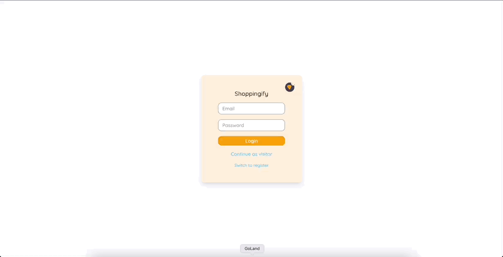
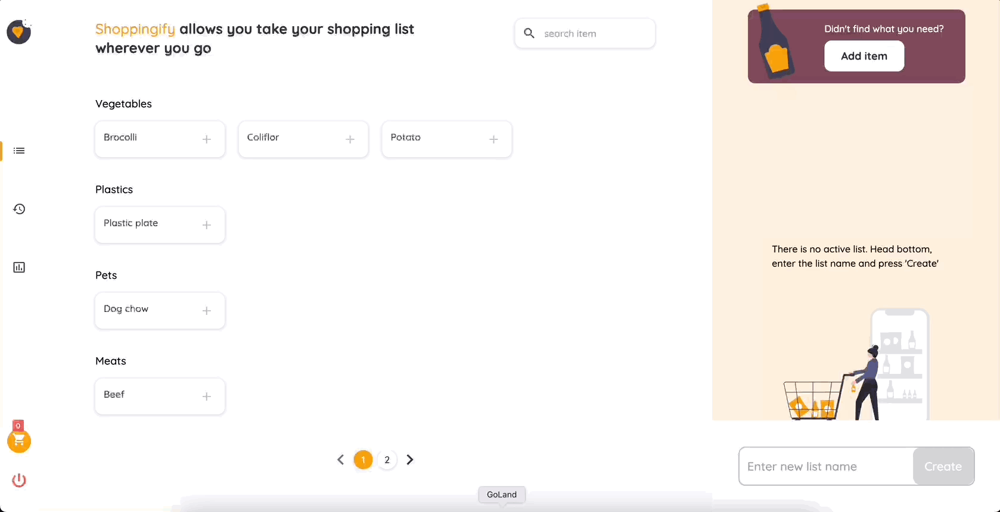
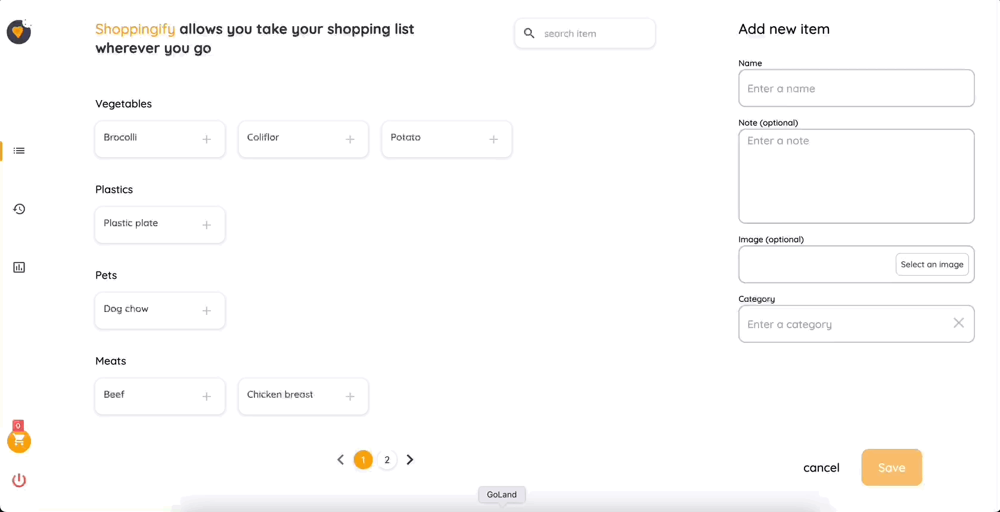
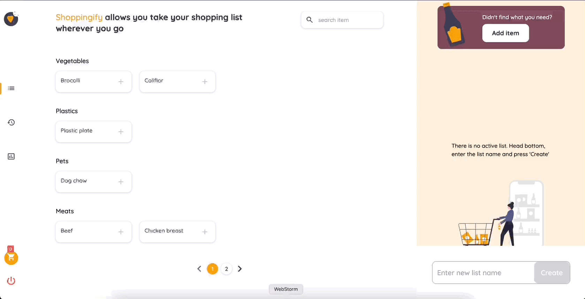
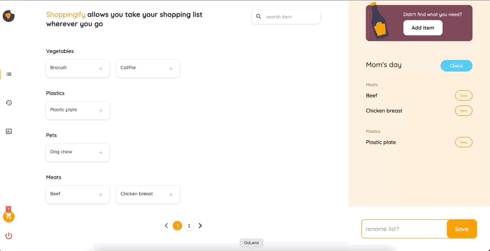
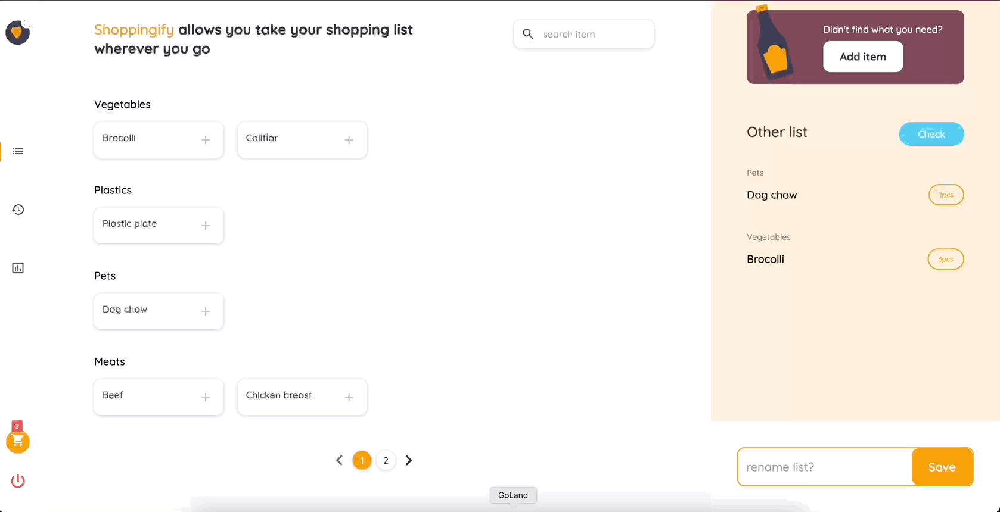
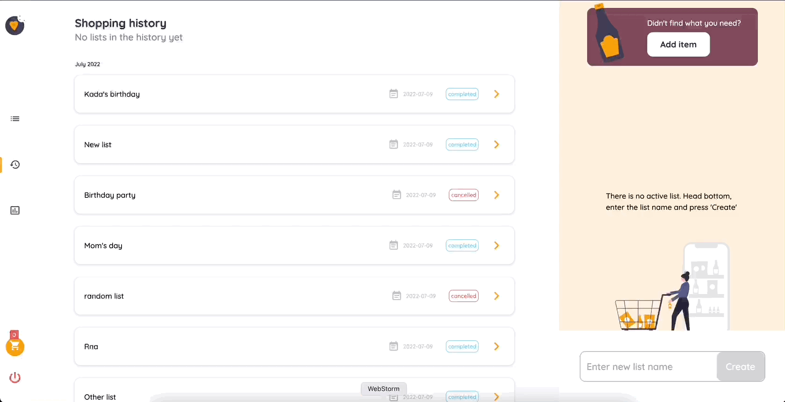
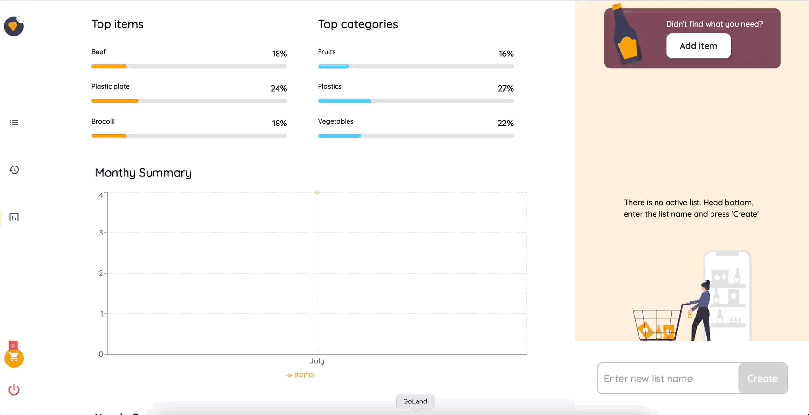

# Shoppingify challenge

Page where you can create shoping lists, save them, keep a record of them and watch some statistics about items you buy.

## Table of contents

* [General info](#general-info)
* [Technologies](#technologies)
* [External libraries](#external-libraries)
* [Scope of functionalities](#scope-of-functionalities)
* [GIFS](#Gifs)
* [Launch](#launch)
* [Project status](#project-status)
* [Link to production site]()

## General info

This is a fullstack site created to fulfill a challenge in the site: [devchallenges.io](https://devchallenges.io/)

## Technologies

* React
* Tailwind
* Docker
* Go
* Postgres
* Git and Github

## External libraries

* [Axios](https://github.com/axios/axios)
* [i18 Next](https://www.i18next.com/overview/getting-started)
* [recharts](https://recharts.org/en-US/)
* [react-toastify](https://fkhadra.github.io/react-toastify/introduction/)

## Scope of functionalities

* When I select the items tab, I can see a list of items under different categories.
* I can add a new item with name, category, note, and image.
* When I add a new item, I can select one from the existing categories or add a new one if the category does not exist
* When I select an item, I can see its details and I can choose to add the current list or delete the item.
* I can add items to the current list
* I can increase the number of item in the list
* I can remove the item from the list
* I can save/update the list with a name (user can have only one active list at a time)
* I can toggle between editing state and completing state
* When I am at completing state, I can save my progress by selecting the item
* I can cancel the active list
* When I try to cancel a list, I can see a confirmation notification
* I can see my shopping history and I can see the details of it
* I can see some statistics: top items, top categories, and monthly comparison.
* I can search for items

## Gifs
* Login and login out

* Adding item

* Deleting item

* Creating list and adding items

* Editing list

* Checking items and completing list

* List history

* List stats

* Searching for item

## Launch

run yarn dev

## Project status

Version 1.0.0